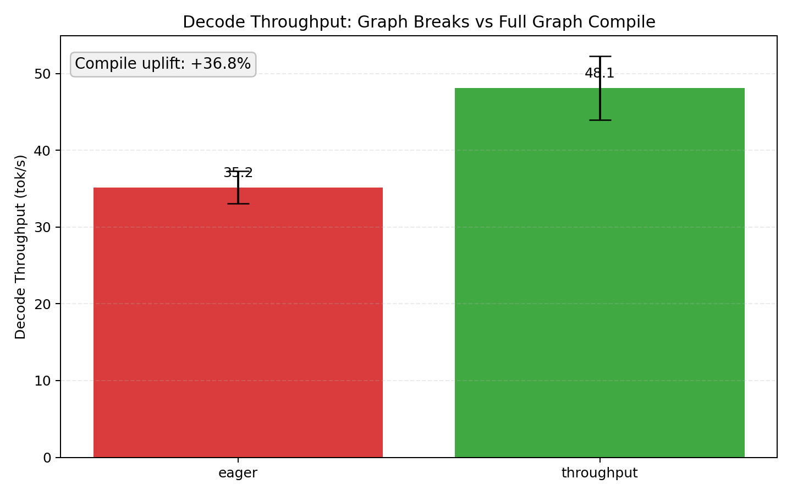

# Hybrid Mamba-TuckerMoE

> **Breaking the Memory Wall: Compute-Bound TuckerMoE for Hybrid State Space Models**
> Research Implementation & Presentation Assets


## Overview

This repository contains the training code, inference implementation, and interactive 3D paper assets for **Hybrid Mamba-TuckerMoE**.

### Key Innovations:

1. **Mamba-3 (Trapezoidal Discretization)**: Replaces standard Euler methods with a higher-order trapezoidal integration scheme and MIMO projections, pushing sequence lengths up to 32K tokens efficiently.
2. **Hybrid Mamba-TuckerMoE**: Combines Mamba-3 selective SSMs with Grouped-Query Attention (GQA) and joint Tucker-decomposed experts. This achieves a **2.4B dense-equivalent capacity** with only **417M parameters** (82.87% compression).
3. **On-the-fly Inference Pipeline**: Eliminates memory bandwidth bottlenecks by processing low-rank latent experts without full weight reconstruction, achieving compute-bound throughput on Apple Silicon.

## 📂 Repository Structure

```text
├── checkpoints/                     # 💾 Model weights (.pt / .npz sidecars)
├── paper/
│   ├── td-moe-iclr2026/             # 📝 ICLR submission & 3D Simulator
│   └── hybrid-mamba-15min/          # 📄 Technical report: "Breaking the Memory Wall"
├── pre-train/                       # 🏋️ Training scripts, logs, and notebooks
├── inference/                       # ⚡ MLX inference: core lib, tools, & results
├── metal/                           # 🤘 Custom Metal kernels & optimization research
├── mamba/                           # 🧠 Core Mamba-3 / MIMO architecture blocks
├── metadata_sft_tiny_llm/           # 🏷️ Vocab & SFT metadata reports
├── train.py                         # 🎯 Unified standalone training script
└── Makefile                         # 🛠️ Development & benchmarking shortcuts
```

---

## 🖥 TuckerMoE 3D Interactive Simulator

As part of the ICLR 2026 paper submission, we provide an interactive 3D web-based presentation simulator.
It visually demonstrates:

- **Tucker Matrix Decomposition** compressing the state space from $134\text{MB}$ to $8.4\text{MB}$.
- **On-the-fly Inference Pipeline**, comparing native block latency against our specialized micro-tensor flow.

### Running the Simulator (Development)

The simulator is built with React, Vite, and Tailwind CSS.

```bash
# 1. Navigate to the simulator directory
cd paper/td-moe-iclr2026/td-moe-simulator-react

# 2. Install dependencies
npm install

# 3. Start the dev server
npm run dev
```

Navigate to `http://localhost:5173` to interact with the 3D pipeline.

---

## 📊 Performance & Efficiency Benchmarks

Hybrid Mamba-TuckerMoE is optimized for **Apple Silicon (Unified Memory Architecture)**, delivering high throughput and low memory footprint.

### Key Results (M2 Pro 16GB):

- **Throughput**: **~3,800 tok/s** (Prefill) | **68 tok/s** (8-bit Quantized Decode).
- **Compression**: **82.87%** parameter reduction (417M actual vs 2.4B dense-equivalent).
- **Memory Efficiency**: **14.1 MiB** KV+State memory @512 steps (80% less than pure Transformers).
- **Compute-Bound**: Fused Metal kernels move MoE dispatch from memory-bound to compute-bound states.

| Metric               | Hybrid (bf16) | Hybrid (8-bit) | Saving vs Transformer |
| :------------------- | :-----------: | :------------: | :-------------------: |
| **Decode Speed**     |   42 tok/s    |    68 tok/s    |           -           |
| **KV Memory (@512)** |   22.3 MiB    |    14.1 MiB    |       **~80%**        |

### Benchmark Visualization

<p align="center">
  
  <br><i>Figure 1: Inference throughput and memory growth analysis on Apple Silicon.</i>
</p>

<p align="center">
  
  
  <br><i>Figure 2: (Left) Pareto Frontier of capacity vs cost; (Right) Graph compilation speedup (+36.8%).</i>
</p>

> [!TIP]
> For a detailed technical breakdown, see the full report: [Breaking the Memory Wall: Compute-Bound TuckerMoE for Hybrid SSMs](paper/hybrid-mamba-15min/report.md).

---

## 🧠 Mamba-3 Architecture Details

Mamba-3 is an advanced iteration of the Selective State Space Model architecture.

- **Trapezoidal Discretization**: Second-order approximation for more accurate continuous-to-discrete mapping.
- **MIMO Projections**: Rank-based expansion (12% latency for 4x capacity).
- **Complex-Valued Dynamics**: RoPE-based simulation of complex SSMs in a real-valued framework.
- **Vision Support**: Integrated Vision Mamba with Snake Scan and bidirectional processing.

## 🚀 Installation & Model Usage

```bash
# Clone repository
git clone https://github.com/s990093/Mamba3-XR.git
cd Mamba3-XR

# Install core dependencies
pip install torch numpy timm scikit-learn matplotlib tqdm
```

### Mamba-3 Core Usage

```python
import torch
from model import Mamba3Block, Mamba3Config

config = Mamba3Config(
    d_model=512,      # Model dimension
    d_state=64,       # SSM state dimension
    d_head=64,        # Head dimension
    n_groups=1,       # Number of groups (MQA/GQA)
    mimo_rank=4,      # MIMO capacity scale
    expand=2,         # Expansion factor
)

model = Mamba3Block(config).cuda()
x = torch.randn(4, 2048, 512).cuda()
y = model(x)
```

## 📈 Training

For easy deployment, use the standalone `train.py` which includes all dependencies:

```bash
# Single-file training (no external dependencies needed)
python train.py
```

It includes:

- Mixed Precision Training (AMP)
- Exponential Moving Average (EMA)
- Auto-scaling Chunk-wise Parallel Scan (SSD)

## 📎 Citation

If you use Hybrid Mamba-TuckerMoE in your research, please cite:

```bibtex
@article{hybrid_mamba_tuckermoe_2026,
  title={Hybrid Mamba-TuckerMoE: Compute-Bound Tensor Decomposition for State Space Models},
  author={Research Implementation},
  journal={Technical Report},
  year={2026}
}
```
