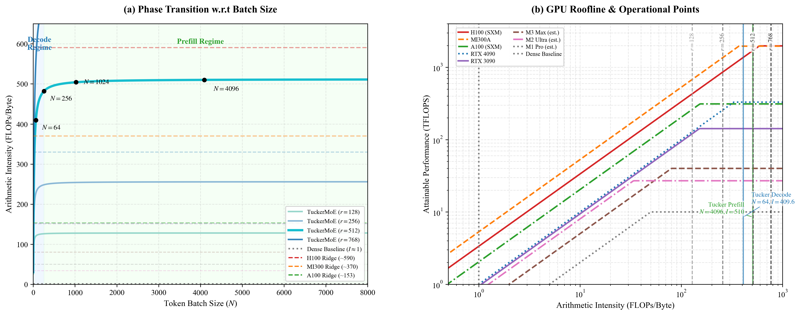

<div align="center">


# Hybrid Mamba-TuckerMoE

**On-Device LLM Inference via Tucker-Decomposed Mixture of Experts**

[](paper/hybrid-mamba-15min/report.md)
[](docs/tucker_moe_justification.html)
[](https://developer.apple.com/metal/)
[](https://github.com/ml-explore/mlx)
[](LICENSE)

Hung-Wei Lai · Hsin-An Lan · Chun-Ming Hsu · Yu-Han Lu

*Department of Computer Science and Information Engineering,*
*National Kaohsiung University of Science and Technology, Taiwan*

</div>

---

## What is This?

This repository contains the training code, MLX inference implementation, Metal kernels, and interactive paper assets for **Hybrid Mamba-TuckerMoE** — a hybrid SSM + MoE architecture designed for efficient, compute-bound inference on memory-constrained devices (Apple Silicon, edge hardware).

The single biggest idea: **Tucker tensor decomposition applied to the expert weight tensor of a Mixture-of-Experts layer**, trained from scratch — not as a post-hoc compression of a pre-existing dense model.

---

## Core Innovation: Tucker-Decomposed MoE

> Most MoE scaling work pays a full `dim_in × dim_out` cost per expert added.
> Tucker MoE makes the **marginal cost of one new expert = r₁ = 4 parameters**.

### The Problem with Dense MoE

A standard MoE stacks `E` independent weight matrices:

```
W ∈ ℝ^(E × d_in × d_out)     # all expert weights
```

Adding one expert costs `d_in × d_out = 3.5M` parameters. At scale, this is prohibitive.

### Tucker Decomposition: One Shared Core, Tiny Per-Expert Coefficients

Tucker MoE factorizes the **entire expert weight tensor** across all three axes simultaneously:

```
W[e, i, j] = Σ_{a,b,c}  G[a,b,c] · U_expert[e,a] · U_in[i,b] · U_out[c,j]
              └── core ──┘  └─ expert axis ─┘  └─ input axis ─┘ └─ output axis ─┘

where:
  U_expert  ∈ ℝ^(E  × r₁)    r₁ = 4      ← only part that grows with E
  U_in      ∈ ℝ^(d_in × r₃)  r₃ = 256    ← shared across all experts
  core      ∈ ℝ^(r₁ × r₃ × r₂)           ← shared across all experts
  U_out     ∈ ℝ^(r₂ × d_out) r₂ = 1024   ← shared across all experts
```

**Adding one expert costs only `r₁ = 4` new parameters** instead of 3.5M.

### Why This Works — Five Key Properties

| Property | What it means |
|---|---|
| **Completeness** | Tucker is an *exact* re-expression of any tensor at full rank — zero information loss before truncation |
| **Controlled truncation** | Truncation error bounded by `Σ σᵢ²` of dropped singular values (HOSVD error bound, tensor analogue of Eckart–Young) |
| **Cross-expert sharing** | `U_in`, `core`, `U_out` shared across all experts — experts differ *only* via their `r₁`-dim coefficient row in `U_expert` |
| **Not a single linear map** | RMSNorm + softmax gating + discrete top-k selection make the full layer **input-conditional piecewise nonlinear** — it does not collapse to one matrix |
| **From-scratch trainable** | No pre-trained dense model required. Tucker here is a *parameterization* (restrict hypothesis class to multilinear rank ≤ (r₁, r₃, r₂)), not a post-hoc compression step — the classical error bound still provides a precision guarantee via a Lipschitz bridge |

→ Full mathematical derivation: [`docs/tucker_moe_justification.html`](docs/tucker_moe_justification.html)

### Parameter Efficiency at a Glance

For `gate_proj` (`d_in=768`, `d_out=4608`, `E=8`):

| | Dense MoE | Tucker MoE |
|---|---:|---:|
| Expert params | 28,311,552 | 5,974,560 |
| Marginal cost / new expert | 3,538,944 | **4** (= r₁) |
| Compression | — | **78.9%** |

Across the full model:

```
Actual parameters:        417M
Dense-equivalent capacity: 2,434M
Compression:              82.87%
```

<p align="center">
  
  <br><i>Tucker MoE sits on the Pareto frontier of capacity vs. parameter cost.</i>
</p>

---

## Architecture Overview

```
Input Tokens
     │
     ▼
 Embedding (d_model = 768)
     │
     ▼
 ┌─────────────────────────────────────────────┐  ×15 macro-layers
 │  Mamba-3 Block × 4   ──┐                   │
 │                         ├─ TuckerMoE gating │
 │  Transformer Block × 1 ─┘                  │
 └─────────────────────────────────────────────┘
     │
     ▼
 RMSNorm → LM Head (tied weights)
```

<p align="center">
  
</p>

### Components

| Component | File | Description |
|---|---|---|
| `Mamba3Block` | [`mlx_model/mamba_block.py`](mamba3_mlx/mlx_model/mamba_block.py) | Trapezoidal SSM + MIMO projections + TuckerMoE gating |
| `TransformerBlock` | [`mlx_model/transformer_block.py`](mamba3_mlx/mlx_model/transformer_block.py) | GQA attention + TuckerMoE FFN |
| `TuckerMoE` | [`mlx_model/tucker_moe.py`](mamba3_mlx/mlx_model/tucker_moe.py) | 8 experts, top-2; precomputes G = U_expert ⊗ core once at load time |
| `chunk_scan` | [`mlx_model/scan_metal.py`](mamba3_mlx/mlx_model/scan_metal.py) | Fused Metal SSM scan; O(Lc) intra-chunk, GPU dispatch inter-chunk |
| `TritonTuckerMoE` | [`pre-train/.../model.py`](pre-train/sft_cot_bundle/scripts/model.py) | Training version with full Triton backward (FusedLatentMoE) |

### Mamba-3 Highlights

- **Trapezoidal Discretization** — second-order continuous-to-discrete mapping (vs. first-order Euler in Mamba-2); supports sequences up to 32K tokens
- **MIMO Projections** — rank-based state expansion, 12% latency overhead for 4× effective capacity
- **Complex-Valued Dynamics** — RoPE-based simulation of complex SSM poles in a real-valued framework

---

## Performance (M2 Pro 16GB)

<p align="center">
  
</p>

| Metric | Value |
|---|---|
| Prefill throughput | **~3,800 tok/s** |
| Decode (bf16) | **42 tok/s** |
| Decode (8-bit selective quant) | **68–87 tok/s** |
| KV + State memory @ 512 steps | **14.1 MiB** (~80% less than pure Transformer) |
| Compile speedup (decode) | **+36.8%** via `mx.compile` |

<p align="center">
  
  
  <br><i>Left: graph compilation speedup. Right: TuckerMoE roofline — MoE dispatch is compute-bound, not memory-bound.</i>
</p>

### Why Compute-Bound Matters

Standard dense MoE at decode time must stream `E × d_in × d_out` weights per token — pure memory-bandwidth pressure. Tucker MoE's shared `U_in / core / U_out` live resident in L2/GPU cache; only the tiny `U_expert[e]` rows are expert-specific. Fused Metal kernels exploit this to **move MoE dispatch from memory-bound to compute-bound** on Apple Silicon's unified memory architecture.

---

## Speculative Decoding

The speculative decode system (`mamba3_mlx/speculative/`) accelerates autoregressive sampling without touching the model weights.

```
Standard AR:   1 tok / forward  →  25 ms/tok
SJD K=8:       ARL ≈ 3.93       →  92/3.93 = 23 ms/tok  →  1.53× speedup
```

**Draft sources (training-free):**

| Source | Principle | ARL contribution |
|---|---|---|
| `SuffixRetriever` | Longest-suffix match on past output (Prompt Lookup) | Long exact phrases |
| `NGramCache` (runtime) | LRU dict: N−1 context → most-likely next | Local repetition |
| `CoT NGram` (pre-baked) | Offline scan of 10,217 training JSONs, phase-aware | **Highest hit rate** |

| Prompt | K | ARL | tps | Speedup |
|---|---|---|---|---|
| self_awareness | 8 | 3.93 | 57.8 | **1.53×** |
| math_drill | 8 | 3.43 | 61.1 | **1.68×** |
| daily_conversation | 8 | 2.93 | 49.4 | **1.26×** |

---

## Quick Start

### Requirements

```bash
git clone https://github.com/s990093/Mamba3-XR.git
cd Mamba3-XR
python -m venv .venv && source .venv/bin/activate
pip install -r requirements.txt
```

Weights (`.npz`, bf16) go in `checkpoints/` — see `AGENTS.md` for `.pt → .npz` sidecar conversion.

### Inference (Apple Silicon)

```bash
# Self-awareness demo
make -C mamba3_mlx

# Emotion mode
make -C mamba3_mlx emotion PROMPT="I feel stuck"

# Deep reasoning with compiled decode
make -C mamba3_mlx deep PROMPT="Explain attention mechanisms" MAX_TOK=512 COMPILE=1

# WebSocket chat server (port :7860)
make -C mamba3_mlx chat

# Direct entry point
python mamba3_mlx/run.py
```

### Speculative Decoding

```bash
# Bake CoT n-gram cache (6 seconds, no model needed)
python mamba3_mlx/speculative/bake_cot_caches.py

make -C mamba3_mlx sjd-self     # self_awareness
make -C mamba3_mlx sjd-math     # math drill
make -C mamba3_mlx sjd-daily    # conversation
```

### Training (PyTorch + Triton)

```bash
python pre-train/train.py        # pre-train / SFT unified entry
python pre-train/kmoe_train.py   # kMoE variant
```

### Benchmarking

```bash
make mlx-bench                                    # full prefill + decode benchmark
make mlx-bench-quick                              # SEQ_LEN=128, DECODE_TOK=512
make mlx-bench CHECKPOINT=weights/model.pt SEQ_LEN=1024
make mlx-profile PROFILE_DECODE_STEPS=32         # per-layer latency
```

---

## Repository Structure

```
├── mamba3_mlx/               # MLX inference stack (Apple Silicon)
│   ├── mlx_model/            #   Model architecture (hybrid, mamba, tucker, scan)
│   ├── mlx_model_v2/         #   v2 with updated scan_metal
│   ├── inference/            #   Generator, sampler, token bans
│   ├── speculative/          #   Speculative decode (Jacobi, ngram, CoT cache)
│   ├── mv/                   #   CoT middleware + FSM format enforcement
│   ├── ui/                   #   Chat frontend (HTML/CSS/JS)
│   └── chat_demo.py          #   FastAPI WebSocket server (:7860)
│
├── pre-train/                # Training (PyTorch + Triton)
│   ├── train.py              #   Unified pre-train + SFT entry
│   └── sft_cot_bundle/       #   Dataset pipeline + model.py (TritonTuckerMoE)
│
├── cot_dataset/              # SFT dataset, tokenizer (vocab 32,007)
├── checkpoints/              # Model weights (.pt / .npz sidecars)
├── metal/                    # Custom Metal shaders (SSM scan, Mamba mixer)
├── paper/hybrid-mamba-15min/ # Technical report + 3D interactive assets
├── docs/                     # Supplementary docs
│   └── tucker_moe_justification.html   # Tucker theory (math + LaTeX)
└── assets/                   # Project visuals
```

---

## Documentation

| Doc | Contents |
|---|---|
| [`docs/tucker_moe_justification.html`](docs/tucker_moe_justification.html) | Full Tucker MoE theory: dense MoE → Tucker derivation, HOSVD error bounds, from-scratch validity proof, backward pass math, ablation plan, research directions |
| [`paper/hybrid-mamba-15min/report.md`](paper/hybrid-mamba-15min/report.md) | Technical report: *Breaking the Memory Wall: Compute-Bound TuckerMoE for Hybrid SSMs* |
| [`CLAUDE.md`](CLAUDE.md) | Codebase guide: inference types, Makefile variables, Metal kernel workflow |
| [`AGENTS.md`](AGENTS.md) | Agent workflow, checkpoint conversion, dataset format |
| [`cot_dataset/SFT_FORMAT.md`](cot_dataset/SFT_FORMAT.md) | ChatML + loss mask spec |

---

## Citation

```bibtex
@article{lai2026hybrid,
  title   = {Hybrid Mamba-TuckerMoE for On-Device LLM Inference},
  author  = {Lai, Hung-Wei and Lan, Hsin-An and Hsu, Chun-Ming and Lu, Yu-Han},
  journal = {Technical Report, ICLR 2026},
  year    = {2026}
}
```
